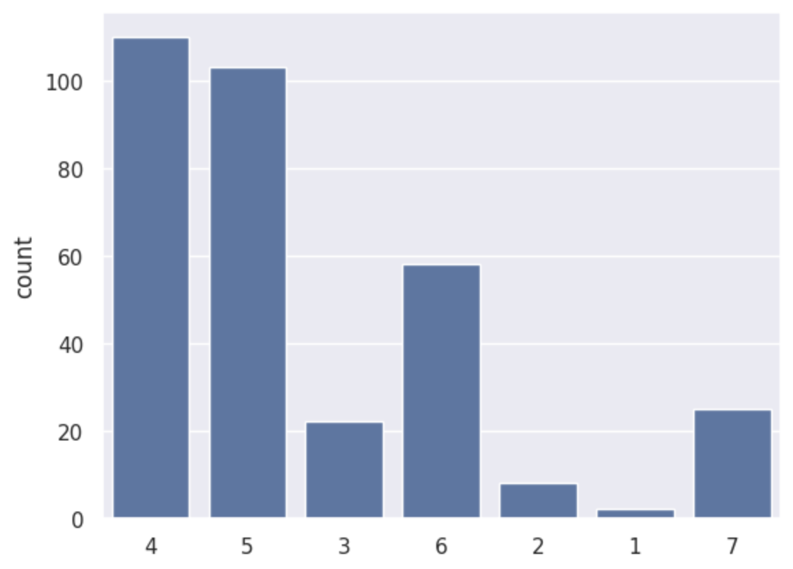
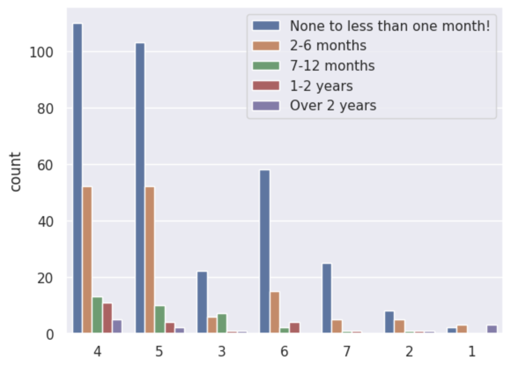
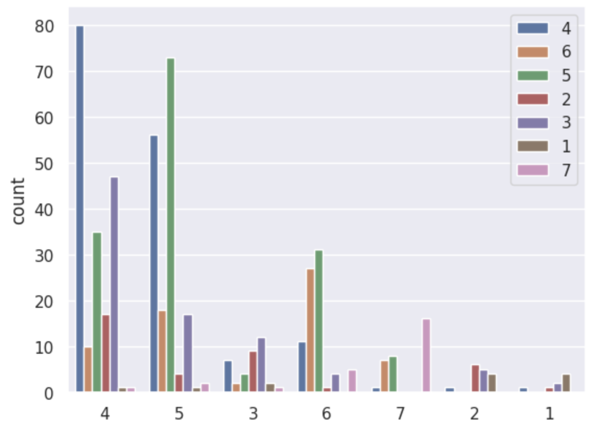

---
# Do not edit the text between these lines!
layout: default
---

# Summary of Survey Analysis Process and Results 

This analysis took survey data collected from the COMP 110 Spring 2026 Class and attempted to see if the course pacing was appropriate for beginner level coding students. An initial suggestion to adjust the pacing of the course to accomodate the beginner level coding students. A variety of functions such as read_csv_rows, columnar, select, and a custom helper function named find_beginners was used to sort and filter the necessary data before converting it into readable bar graphs. The graphs are detailed with their results below. 

<!-- This is a comment. Below, you'll see code for inserting an image. To make this image appear, update <custom-path>. To add an image, save it inside the imgs folder of this repository. -->

# Graph Choice Process: Access and Rationale

Disclaimer: Graphs do not have additional labeling past what was indicated by instructions because I saw that additional labeling and features were optional and had  my graphs looked at and approved at office hours 

I navigated to the seaborn.pydata.ord/api.html link provided to explore the different types of distribution plots I could pick from and under categorical I chose count plot to show the counts of observations in each categorical bin using bars. This will also prevent any complex grouping that I would have to do if I had chosen something like catplot. 

To do this I imported seaborn as sns and set the theme along with creating a countplot. I chose a countplot because the pace ratings are categorical choices representing a comfort with the speed of the course and overall will be showing frequency of categories rather than a relationship between variables. 

I could not use a scatterplot because there isn't two numeric values with a relationship between variables at the point of analysis. I couldn't use a lineplot because I was not observing a trend over time with this data. 

## Graph 1: Count of Course Pacing Selections from Beginner Students 

The graph shows the ratings of the course pacing from beginner students. A countplot was used and  the x axis reflects data concerning pacing with the y axis representing data for the count of the studets that selected a certain pacing. A majority of the responses were centered around 4 and 5 indicating that many beginners felt that the pace of the course was moderate to fast.

## Graph 2: Count of Pacing Selections by Prior Experience Level 

The graph shows the pacing ratings across all experience levels of the students in the class. The data was split into groups with hue and as a result the bar graph contains multiple colored bars per category with each color representing a different experience level. It shows that beginners rate the pacing slightly higher than their peers with prior programming experience. 

## Graph 3: Count of Pacing Compared to Student Reported Course Difficulty 

The graph shows a basis for a relationship between perceieved difficulty and course pacing ratings.A countplot was used and  the x axis reflects data concerning pacing with the y axis representing data for the count of how many students fall into each of the combined groups. The hues show level of difficulty.The higher the pacing rating, the higher the course difficulty was perceived by the students. 

## Conclusion: Summary of Suggestion Outcome
The analysis shows that while this does not prove that the pacing of the course is contributing to increased difficulty for beginners it does suggest that faster pacing may be associated with students finding the content a little more difficult. Overall, the evidence does not support the suggestion that an adjustment in the course pacing is necessary for beginner students. 

## Conclusion: Recommendations and Constraints 
One recommendation would be to offer a recitation period for the course where students can work collectively on coding with a TA present. This would allow for more accessible hours for tutoring style help and allow students to work out problems togther rather than the single ticket method instead of following my original suggestion. The original suggestion could potentially put more experienced students at risk and slow down their engagement in the course and the rate at which they are learning due to not being able to cover enough content or increasing general disinterest due to a pace that is too slow. 

## Conclusion: Refinements 
An alternate idea or refinement to consider would be to increase teh amount of practice prompts available to students since they are required to practice coding daily. For beginner programmers it can be difficult to successfully follow a self created prompt and then make sure that they are sticking to the scope of the course or fully testing their capabilities to prepare for exams. In the future it could help to analyze other holistic factors concerning a student's available study time after class other than just social media and tutoring usage. Some students also commute and appreciate there being online help available as well during normal tutoring hours other than the tutoring center. 

## Thank you!